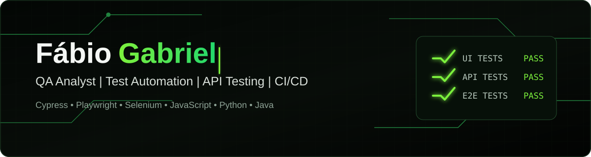

  

  <strong>QA Analyst com foco em testes manuais, automação E2E, APIs e qualidade contínua.</strong>

  Atuação prática com Cypress, Playwright e Selenium em projetos com JavaScript, Python e Java, além de testes funcionais e de contrato, Docker e pipelines de CI/CD com GitHub Actions.

## Stack principal

  
  
  
  
  
  
  

  
  
  
  
  
  
  

## Resultados em destaque

  
  
  

  <strong>Qualidade é antecipar riscos, validar fluxos críticos e prevenir falhas antes que cheguem ao usuário.</strong>

  
  
  

